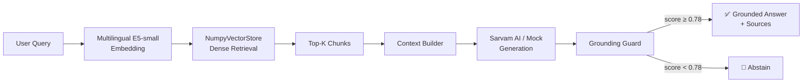

# 🧠 ज्ञान Gyaan RAG

**An Indic-first Retrieval-Augmented Generation system for evidence-grounded question answering in Hindi and English.**


---

## ✨ Overview

**Gyaan RAG** (ज्ञान = *knowledge* in Hindi/Sanskrit) is a research-grade Retrieval-Augmented Generation system designed to answer factual questions by grounding responses in evidence retrieved from a knowledge base — rather than relying on an LLM's parametric memory alone.

The system:

1. **Accepts** natural-language queries in Hindi or English
2. **Embeds** the query using a multilingual sentence encoder
3. **Retrieves** semantically relevant passages from a local vector index
4. **Constructs** a grounded context from top-ranked chunks
5. **Generates** an answer conditioned on that context
6. **Applies** a grounding guard to verify the answer is supported by retrieved evidence
7. **Abstains** when retrieved context is insufficient — rather than generating unsupported claims

> **Gyaan RAG does not claim zero hallucinations.** It applies retrieval-score thresholding and lexical-overlap verification to reduce unsupported generation. When these checks fail, the system returns a safe abstention message instead of fabricating an answer.

---

## 🎯 Why Gyaan RAG?

Standard LLMs answer from parametric memory — knowledge baked in at training time. This creates risks:

- Outdated information
- Confident but unsupported claims
- Failure on domain-specific or Indic-language content

**Gyaan RAG** grounds answers in retrieved evidence:

```
User Question
      ↓
  Embedding
      ↓
Dense Retrieval
      ↓
Top-K Passages
      ↓
Context Assembly
      ↓
LLM Generation (conditioned on context)
      ↓
 Grounding Guard
   ↙         ↘
Grounded    Abstain
 Answer
```

This is especially relevant for **Indic-language factual QA**, where LLMs often lack sufficient training coverage and retrieval over curated corpora provides more reliable grounding.

---

## 🚀 Key Features

- 🌐 **Hindi-first querying** — accepts Devanagari queries and returns answers in the same language
- 🔤 **English support** — seamlessly handles English queries over the same index
- 🤗 **Multilingual E5-small embeddings** — `intfloat/multilingual-e5-small` supports 94 languages including Hindi, Bengali, Tamil, Telugu, Urdu
- 🎯 **Dense semantic retrieval** — fast cosine similarity over a local NumPy vector store
- 📦 **Semantic/structure-aware chunking** — groups coherent adjacent passages for better recall
- 🛡️ **Grounding guard** — retrieval score thresholding + lexical overlap verification
- 🚫 **Safe abstention** — refuses to answer when context is insufficient, instead of hallucinating
- 📎 **Source attribution** — every answer links back to the retrieved passages that grounded it
- ⚡ **Sub-100ms retrieval** — local NumPy index, no external vector DB required
- 🧩 **Modular FastAPI backend** — clean separation of ingestion, retrieval, generation, and API layers
- 🖥️ **Research-oriented frontend** — brutalist/poster-style UI with Hindi/English support
- 🔌 **Offline mock mode** — runs without a paid API key for development and evaluation
- 🤝 **Sarvam AI adapter** — production generation via [Sarvam AI](https://sarvam.ai/) Indic LLM

---

## 🧩 Architecture



### Component Map

| Layer | Module | Responsibility |
|-------|--------|---------------|
| Ingestion | `backend/ingestion/` | Load MSMARCO-XI Parquet → clean → chunk |
| Chunking | `backend/ingestion/chunkers/` | Passage / Sliding-window / Semantic strategies |
| Embeddings | `backend/retrieval/embeddings.py` | E5-small query & passage encoding |
| Dense Index | `backend/retrieval/vector_store.py` | NumPy cosine similarity store |
| Sparse Index | `backend/retrieval/bm25.py` | Custom BM25 lexical retriever |
| Hybrid | `backend/retrieval/hybrid.py` | Reciprocal Rank Fusion |
| Generation | `backend/generation/` | Mock / Sarvam adapters + context builder |
| Grounding | `backend/generation/guard.py` | Score threshold + lexical overlap guard |
| API | `backend/api/app.py` | FastAPI — serves frontend + `/api/query` |
| Frontend | `frontend/` | Vanilla JS + CSS research UI |

---

## 🔬 Retrieval Pipeline Detail

### 1 — Data Ingestion

Source: [`ai4bharat/MSMARCO-XI`](https://huggingface.co/datasets/ai4bharat/MSMARCO-XI) on Hugging Face Hub.

The dataset is loaded via Parquet files (the dataset script references missing JSONL files; Parquet is the reliable path). The ingestion pipeline:

- Loads Parquet shards for the Hindi (`hi`) split
- Normalises fields: `query_id`, `query`, `passages`, `Answer`, `meta`
- Cleans and deduplicates passage text

### 2 — Chunking Strategies

Three strategies are implemented and benchmarked:

| Strategy | Description |
|----------|-------------|
| **Passage-aware** | Respects dataset passage boundaries; one chunk per passage |
| **Sliding-window** | Fixed-size overlapping windows (size=500, overlap=50 tokens) |
| **Semantic/structure** | Groups adjacent semantically similar passages into coherent units |

**Semantic chunking was selected** based on Phase 4 evaluation results.

### 3 — Embedding & Indexing

- Model: `intfloat/multilingual-e5-small` (384-dim, ~118M params)
- Queries prefixed with `"query: "`, passages with `"passage: "` (E5 instruction format)
- Embeddings stored as L2-normalized NumPy arrays → dot product = cosine similarity
- Index persisted to `data/indexes/{strategy}/dense/` (excluded from git)

### 4 — Retrieval

- **Dense**: matrix dot-product, top-K by cosine score
- **Sparse**: custom BM25 with positive IDF formula
- **Hybrid**: Weighted Reciprocal Rank Fusion (RRF) combining both

### 5 — Generation & Grounding

The generation layer receives top-K chunks and:

1. Builds a context string from passages
2. Sends query + context to the LLM
3. Passes the result through the grounding guard

**Grounding Guard** (`backend/generation/guard.py`):

- Checks maximum retrieval similarity score against threshold (default: **0.78**)
- Verifies lexical overlap between retrieved context and generated answer
- If either check fails → returns abstention instead of the generated answer

**Abstention message** (returned when context is insufficient):
> *"I don't have enough information in the retrieved sources to answer that reliably."*

---

## 📊 Research Results

> These are offline evaluation results measured on the **Hindi query split** of MSMARCO-XI.  
> They are not live production metrics.

### Retrieval Benchmark — 104 Hindi Queries

| Chunk Strategy | Method | R@1 | R@5 | R@10 | MRR@10 | Index Size | Latency |
|---|---|---|---|---|---|---|---|
| passage | Dense | 0.404 | 0.750 | 0.913 | 0.556 | 11.74 MB | 95.03 ms |
| passage | BM25 | 0.183 | 0.644 | 0.788 | 0.363 | 11.74 MB | 4.33 ms |
| sliding_window | Dense | 0.433 | 0.904 | 0.952 | 0.617 | 9.84 MB | 95.68 ms |
| sliding_window | BM25 | 0.308 | 0.798 | 0.865 | 0.488 | 9.84 MB | 3.69 ms |
| **semantic** | **Dense** | **0.413** | **0.923** | **0.971** | **0.625** | **9.20 MB** | **88.81 ms** |
| semantic | BM25 | 0.288 | 0.817 | 0.856 | 0.521 | 9.20 MB | 2.42 ms |

**Selected configuration: Semantic Chunker + Dense Retrieval**

### Why Semantic + Dense?

- Highest **Recall@5 (0.923)**, **Recall@10 (0.971)**, and **MRR@10 (0.625)**
- Smallest index (**9.20 MB**) — semantic grouping compresses without losing coverage
- BM25 suffers from synonym mismatches in translated Hindi text; E5 handles these semantically
- Hybrid (RRF) underperforms dense when sparse quality is substantially lower

---

## 🛡️ Grounding & Abstention

The grounding guard (`backend/generation/guard.py`) prevents the system from returning answers that are not supported by retrieved evidence.

**Guard logic:**

```python
max_score = max(chunk.score for chunk in retrieved_chunks)

if max_score < MIN_RETRIEVAL_SCORE:          # default 0.78
    return ABSTENTION

if lexical_overlap(answer, context) < threshold:
    return ABSTENTION
```

**Threshold calibration** (from Phase 5 analysis):

| Threshold | Recall | FP Rate | Notes |
|-----------|--------|---------|-------|
| 0.75 | 1.000 | 1.000 | Too permissive — passes irrelevant queries |
| 0.78 | 0.951 | 0.742 | **Selected** — good recall, filters clear out-of-domain |
| 0.86 | 0.784 | 0.287 | Too strict — drops valid in-domain answers |

The guard is intentionally conservative: it is better to abstain than to confidently return an unsupported answer.

---

## 🗂️ Project Structure

```
gyaan-rag/
│
├── backend/
│   ├── api/
│   │   └── app.py              # FastAPI app — serves frontend + /api/query
│   ├── core/
│   │   └── config.py           # Pydantic settings, all config via env vars
│   ├── generation/
│   │   ├── base.py             # Abstract generator interface
│   │   ├── context.py          # Context string builder
│   │   ├── guard.py            # Grounding guard + abstention
│   │   ├── mock.py             # Offline mock generator (no API key needed)
│   │   └── sarvam.py           # Sarvam AI generation adapter
│   ├── ingestion/
│   │   ├── chunkers/
│   │   │   ├── base.py         # Abstract chunker interface
│   │   │   ├── passage.py      # Passage-boundary chunker
│   │   │   ├── sliding_window.py # Overlapping window chunker
│   │   │   └── semantic.py     # Semantic/structure chunker (selected)
│   │   ├── cleaner.py          # Record normalisation and deduplication
│   │   ├── dataset_loader.py   # Parquet loader for MSMARCO-XI
│   │   └── metadata.py         # Metadata extraction helpers
│   └── retrieval/
│       ├── bm25.py             # Custom BM25 sparse retriever
│       ├── embeddings.py       # E5-small encoder (query + passage)
│       ├── hybrid.py           # RRF hybrid retrieval
│       └── vector_store.py     # NumPy dense vector store
│
├── frontend/
│   ├── components/
│   │   ├── AnswerCard.js       # Answer display with grounding badge
│   │   ├── Hero.js             # Header/poster section
│   │   ├── Navbar.js           # Navigation with language selector
│   │   ├── QueryInput.js       # Search input + submit
│   │   ├── RagPipeline.js      # Pipeline flow visualisation
│   │   ├── ResearchMetrics.js  # Evaluation results display
│   │   ├── SourcesPanel.js     # Retrieved source cards
│   │   ├── SystemStatus.js     # Backend config status board
│   │   └── WhyGyaanRag.js      # Why RAG section with feature cards
│   ├── assets/
│   ├── app.js                  # Main JS entry — mounts all components
│   ├── index.html              # HTML shell (served by FastAPI)
│   └── style.css               # Brutalist design system (no frameworks)
│
├── scripts/
│   ├── build_index.py          # Build + persist dense/BM25 indexes
│   ├── evaluate_retrieval.py   # Offline retrieval benchmark
│   ├── evaluate_generation.py  # Generation quality evaluation
│   ├── calibrate_threshold.py  # Grounding guard threshold analysis
│   ├── analyze_thresholds.py   # Threshold precision/recall curves
│   ├── compare_chunking.py     # Compare chunking strategies
│   ├── inspect_parquet_repository.py # Inspect HF dataset files
│   └── probe_dataset_topics.py # Probe what topics are in the index
│
├── reports/
│   ├── retrieval_evaluation.md  # Full retrieval benchmark results
│   ├── chunking_evaluation.md   # Chunking strategy comparison
│   ├── generation_evaluation.md # Generation quality analysis
│   └── dataset_repository.md   # MSMARCO-XI dataset documentation
│
├── data/
│   └── indexes/                # ⚠️ Git-ignored — generated by build_index.py
│       ├── passage/
│       ├── sliding_window/
│       └── semantic/           # ← active index (semantic + dense)
│
├── .env.example                # Environment variable template
├── .gitignore
├── requirements.txt
└── README.md
```

---

## ⚙️ Installation

### Prerequisites

- Python 3.11+
- Git

### Clone & Install

```bash
git clone https://github.com/Sai98-git/Gyaan-Rag.git
cd Gyaan-Rag
```

Create a virtual environment (recommended):

```bash
# Windows
python -m venv .venv
.venv\Scripts\activate

# macOS / Linux
python -m venv .venv
source .venv/bin/activate
```

Install dependencies:

```bash
pip install -r requirements.txt
```

---

## 🔐 Environment Variables

Copy the example file:

```bash
cp .env.example .env     # macOS / Linux
copy .env.example .env   # Windows
```

Edit `.env` with your values. Key variables:

| Variable | Default | Description |
|----------|---------|-------------|
| `GENERATION_PROVIDER` | `mock` | `mock` (no API key) or `sarvam` |
| `SARVAM_API_KEY` | *(none)* | Required only when `GENERATION_PROVIDER=sarvam` |
| `EMBEDDING_MODEL_NAME` | `intfloat/multilingual-e5-small` | HuggingFace model ID |
| `CHUNK_STRATEGY` | `semantic` | `passage`, `sliding_window`, or `semantic` |
| `MIN_RETRIEVAL_SCORE` | `0.78` | Grounding guard threshold |
| `RETRIEVAL_TOP_K` | `10` | Number of chunks to retrieve |
| `HF_TOKEN` | *(none)* | Optional — unlocks higher HF rate limits |

> **Never commit your `.env` file.** It is in `.gitignore`.

---

## 🏗️ Building the Index

Before running the application, you must build the vector index from the MSMARCO-XI dataset.

The dataset is downloaded automatically from Hugging Face on first run.

```bash
# Build the semantic index (recommended — used in production config)
python -m scripts.build_index

# The index will be saved to data/indexes/semantic/
```

This step:
1. Downloads the Hindi split of `ai4bharat/MSMARCO-XI` from Hugging Face
2. Normalises and cleans records
3. Applies semantic chunking
4. Encodes all chunks with `intfloat/multilingual-e5-small`
5. Saves `embeddings.npy`, `metadata.json`, and `bm25_index.json` locally

> ⏱ Index build time depends on `MAX_RECORDS` (default: 25,000). Expect ~5–15 minutes on first run.

---

## ▶️ Running the Application

Start the FastAPI server:

```bash
python -m uvicorn backend.api.app:app --host 127.0.0.1 --port 8000
```

Then open your browser at:

```
http://127.0.0.1:8000
```

The frontend is served directly by FastAPI from the `frontend/` directory.

---

## 🧪 Evaluation & Reports

Evaluation scripts are in `scripts/` and reports are in `reports/`:

| Report | Description |
|--------|-------------|
| [`reports/retrieval_evaluation.md`](reports/retrieval_evaluation.md) | Full retrieval benchmark across all chunkers + methods |
| [`reports/chunking_evaluation.md`](reports/chunking_evaluation.md) | Chunking strategy comparison and analysis |
| [`reports/generation_evaluation.md`](reports/generation_evaluation.md) | Generation quality + grounding guard analysis |
| [`reports/dataset_repository.md`](reports/dataset_repository.md) | MSMARCO-XI dataset structure documentation |

Run retrieval evaluation:

```bash
python -m scripts.evaluate_retrieval
```

Run generation evaluation:

```bash
python -m scripts.evaluate_generation
```

---

## 🛠️ Tech Stack

| Component | Technology |
|-----------|-----------|
| Backend framework | [FastAPI](https://fastapi.tiangolo.com/) |
| Embedding model | [intfloat/multilingual-e5-small](https://huggingface.co/intfloat/multilingual-e5-small) |
| Vector store | Custom NumPy cosine similarity index |
| Sparse retrieval | Custom BM25 implementation |
| Dataset | [ai4bharat/MSMARCO-XI](https://huggingface.co/datasets/ai4bharat/MSMARCO-XI) |
| LLM generation | [Sarvam AI](https://sarvam.ai/) / Mock (offline) |
| Frontend | Vanilla JavaScript + CSS (no frameworks) |
| Fonts | Google Fonts — Archivo Black, Space Grotesk, Yatra One, Rozha One, Caveat |
| Configuration | Pydantic Settings + python-dotenv |

---

## 🔮 Future Work

These are not implemented — they are directions for future research and development:

- **Stronger multilingual evaluation** — evaluate on Bengali, Tamil, Telugu query splits
- **Larger Indic corpora** — index multiple language shards beyond the dev Hindi split
- **Answer reranking** — add a cross-encoder reranker between retrieval and generation
- **FAISS/vector DB** — replace NumPy store for production-scale datasets
- **Improved citation UX** — inline source highlighting in the generated answer
- **Additional generation providers** — OpenAI, Gemini adapters
- **Extended evaluation benchmarks** — TyDi QA, XQuAD for broader Indic QA coverage
- **Fine-tuned Indic embeddings** — domain-specific embedding fine-tuning

---

## 🤝 Contributing

Contributions are welcome!

1. Fork the repository
2. Create a feature branch: `git checkout -b feat/your-feature`
3. Make your changes with tests where applicable
4. Commit: `git commit -m "feat: describe your change"`
5. Push: `git push origin feat/your-feature`
6. Open a Pull Request with a clear description

Please ensure no secrets, API keys, or large binary files are included in PRs.

---

## 📜 License

No license file is currently present in this repository.  
If you intend to use or build upon this project, please contact the author for permissions.

---

## 👨‍💻 Author

**Sai Sonawane**  
[@Sai98-git](https://github.com/Sai98-git)

---

## ⭐ Support

If you find Gyaan RAG interesting or useful for your research, consider giving the repository a ⭐ on GitHub.
